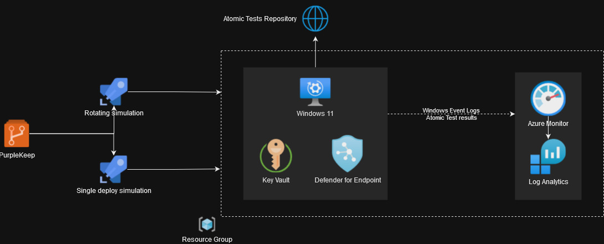

# Introduction 

This project provides Azure-based pipelines to create an infrastructure and run Atomic tests. 

## Requirements

The project is based on Azure Pipelines and requires the following to be able to run:
- Azure Service Connection to a resource group
- MDE onboarding script, placed as a Secure File in the Library of Azure DevOps and make it accessible to the  pipelines

### Optional

You can provide a security and/or audit policy file that will be loaded to mimic your Group Policy configurations. Use the Secure File option of the Library in Azure DevOps to make it accessible to your pipelines.

Refer to the [variables](variables.yml) file for your configurable items.

## Design

## Infrastructure

Deploying the infrastructure uses the Azure Pipeline to perform the following steps:
- Deploy Azure services:
    - Key Vault
    - Log Analytics Workspace
    - Data Connection Endpoint
    - Data Connection Rule
- Generate SSH keypair and password for the Windows account and store in the Key Vault
- Create a Windows 11 VM
- Install OpenSSH
- Configure and deploy the SSH public key
- Install Invoke-AtomicRedTeam 
- Install Microsoft Defender for Endpoint and configure exceptions
- (Optional) Apply security and/or audit policy files
- Reboot

## Simulation

Currently only the Atomics from the public repository are supported. The pipelines takes a Technique ID as input or a comma seperate list of techniques, for example:
- T1059.003
- T1027,T1049,T1003

The logs of the simulation are ingested into the AtomicLogs_CL table of the Log Analytics Workspace.

There are currently two ways to run the simulation:

### [Rotating simulation](rotate_simulation.yml)

This pipeline will deploy a fresh platform after the simulation of each TTP. The Log Analytic workspace will maintain the logs of each run.

**Warning: this can potentially onboard a large number of new hosts into your EDR**

### [Single deploy simulation](single_deploy_simulation.yml)

A fresh infrastructure will be deployed only at the beginning of the pipeline. All TTP's will be simulated on this instance. This is the fastests way to simulate and prevents onboarding a large number of devices, however running a lot of simulations in a same environment has the risk of contaminating the environment and making the simulations less stable and predictable.

## TODO

### Must have
* [x] Check if pre-reqs have been fullfilled before executing the atomic
* [x] Provide the ability to import own group policy
* [x] Cleanup biceps and pipelines by using a master template (Complete build)
* [x] Build pipeline that runs technique sequently with reboots in between
* [x] Add Azure ServiceConnection to variables instead of parameters

### Nice to have
* [ ] MDE Off-boarding (?)
* [ ] Make Atomics repository configureable
* [ ] Deploy VECTR as part of the infrastructure and ingest results during simulation. Also see the [VECTR API issue](https://github.com/SecurityRiskAdvisors/VECTR/issues/235)
* [ ] Tune alert API call to Microsoft Defender for Endpoint (Microsoft.Security alertsSuppressionRules)
* [ ] Add C2 infrastructure for manual or C2 based simulations

## Issues

* [ ] Atomics do not return if a simulation succeeded or not
* [ ] Unreliable OpenSSH extension installer failing infrastructure deployment
* [ ] Spamming onboarded devices in the EDR

## Credits

* https://github.com/splunk/attack_range
* https://redcanary.com/blog/coalmine/